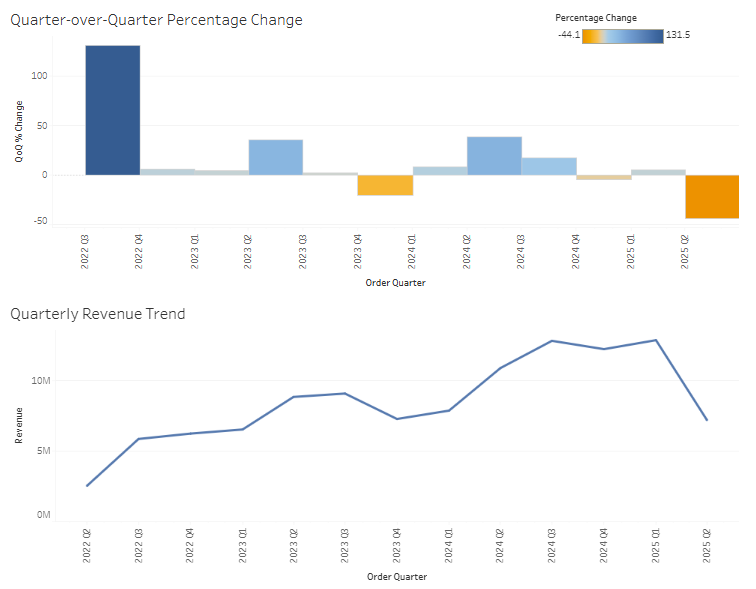
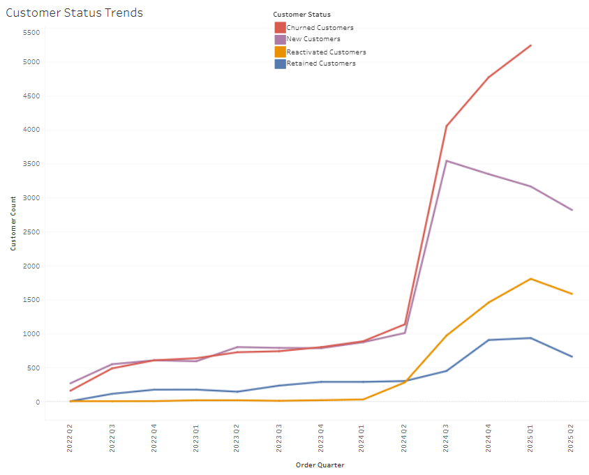
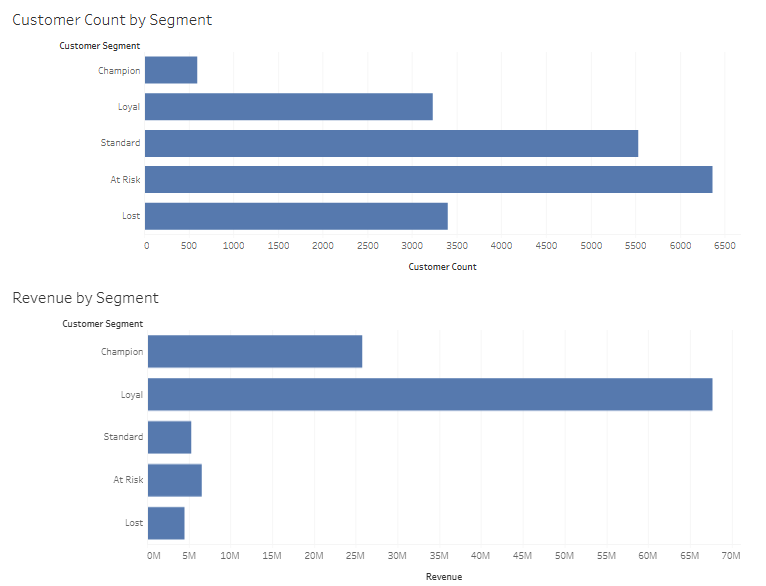
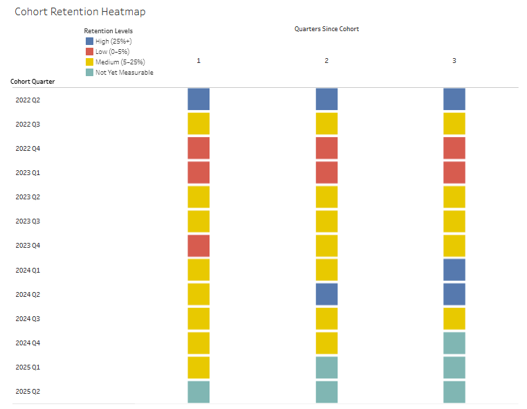

# Adventure Works Sales Analytics

## Overview
This project analyzes customer behavior and sales performance using Microsoft's
AdventureWorks sales database, covering quarter-over-quarter revenue growth, customer churn, RFM-based customer segmentation, and customer cohort retention.
## Tools
- PostgreSQL / DBeaver
- Python (pandas)
- Tableau Public
- Git
## Project Structure
- `Initial Queries` - SQL queries run against the AdventureWorks database
- `Raw csvs` - unprocessed query exports
- `Data Cleaning` - pandas notebooks that clean and reshape the raw exports for Tableau
- `Clean csvs` - final, cleaned output ready for Tableau
- `Follow-up Queries` - SQL queries to answer follow-up questions
- `Images` - dashboard screenshots referenced in Key Findings
## Pipeline / Process
I queried the database in DBeaver, and exported those results as CSVs. Rather than taking the raw exports straight to Tableau, I cleaned and reformatted them using pandas in VSCode. I changed data types, reshaped some CSVs to long format, and created is_measurable columns so I could flag values that weren't measurable and filter them out when making dashboards. These changes are meant to make working with the CSVs in Tableau easier. After that, I exported the clean CSVs, which were now ready for Tableau.
## Design Approach
After working with the database, one of the first design decisions I made was to use quarters instead of months, because many of the company's sales were on a quarterly basis. By analyzing on a quarterly basis, the actual trends of the company are more clear. Another recurring design decision I made throughout this project was to make values that were immeasurable null instead of letting them default to zero. This showed up through multiple queries, but most notably in the cohort_retention_analysis, where I set the immeasurable values at 1, 2, and 3 quarters after each customer's cohort_quarter to null instead of 0. Then the addition of the is_measurable boolean column lets me filter this out when making visualizations. 
## Key Findings
[View the interactive dashboards on Tableau Public](https://public.tableau.com/views/AdventureWorksSalesAnalytics_17853862787110/QuarterlyRevenueTrendDashboard?:language=en-US&:sid=&:redirect=auth&:display_count=n&:origin=viz_share_link)
### Quarterly Revenue Trend
Adventure Works quarterly revenue increased from 2.5 million dollars in early 2022 to 12.8 million at the beginning of 2025 before taking a steep decline to 7.2 million in the following quarter, a 44% decline. To further investigate the sudden decline, I compared KPIs of 2025 Q1 to 2025 Q2. I found that the 44% decrease in revenue can be attributed to a 14.2% decrease in order volume and a 14.3% decrease in customer count, while average order value decreased by 34.8% and average customer revenue fell by 34.7%. In unison, these factors led to the largest quarter-over-quarter revenue drop in the data. The fact that orders per customer stayed nearly identical between quarters supports a wholesale/inventory-ordering pattern, which is also why sales line up better on a quarterly than monthly basis. Further investigation into product mix or promotional timing would help pinpoint the exact driver, though that's outside this project's customer-behavior scope.

### Customer Status Trends
In customer status trends, I classified customers based off of the previous quarter and next quarter using lag/lead. I classified customers as new if they hadn't ordered before, retained if they ordered in the previous and current quarter, and reactivated if they had ordered in the past, but hadn't ordered in the previous quarter and did order in the current quarter. In a separate classification, I labeled customers as churned if they didn't order in the next quarter. I also made sure that customers in the last quarter of the data weren't mislabeled as churned when it was just the end of the data.

What stands out in this line graph is the jump from 1,134 to 4,055 churned customers and 1,006 to 3,543 new customers between the second and third quarter of 2024. To investigate further, I went to the ER diagram of the AdventureWorks database and found a boolean column that flagged whether an order was made online or not. When I broke down the online and offline orders by each quarter, I found that online orders jumped from 1220 to 4882 orders between the second and third quarter of 2024. This alignment between the increase in online orders and the spike in new and churned customers suggests that some sort of push to increase online traffic resulted in about a 300% increase in online orders, 252% increase in new customers, and 258% increase in churned customers. Because churn is defined by not returning the following quarter, an increase in one-time buyers would produce this pattern of simultaneous spikes in both new and churned. That's consistent with the online order surge being the source of that burst, supporting the hypothesis of a push toward online traffic.

### RFM Customer Segmentation

In RFM customer segmentation, I scored customers in five segments based on recency, frequency, and monetary value. With 5 being the best, customers labeled champion scored 5s in all categories, loyal scored 5 in frequency, at-risk being a recency score of 2 or 3, lost being a recency score of 1, and everything else being standard. This scoring was in reference to 2025-07-01, while the last order posted was 2025-06-29. The timing of this segmentation and the high at-risk customers are consistent with the churn analysis since churned customers peaked in 2025 Q1. Moving down to the revenue by segment, it is clear that most of the revenue is being generated by customers segmented as loyal and champion. This aligns with the wholesale/inventory-ordering sales pattern.

### Cohort Retention

To measure cohort retention, I grouped customers into cohort quarters based on the quarter that they placed their first order in. Then I made quarters_since_cohort to calculate how many quarters after the cohort each order occurred, which let me isolate the customers who ordered again in quarters 1, 2, and 3. Using these customer counts, I could make a retention percentage that tells how many of the cohort customers ordered 1, 2, and 3 quarters after their cohort. This makes each retention percentage an independent snapshot of that one quarter, and not a running total of who is still active. I also had to account for nulls at the end of the data range so they were not to be confused with quarters where 0 of the cohort customers ordered again. 

What initially stands out from the heatmap is that retention is stagnant, which fits with retention being a per-quarter snapshot rather than a steadily declining curve, besides the recent bump in the 2024 Q1 and Q2 cohorts. With only two cohorts showing this, it is too early to consider it a trend. One observation I made is that the wholesale/inventory ordering trend doesn't show up here across the 3 quarters since cohort because we are looking at customer counts instead of revenue. 

